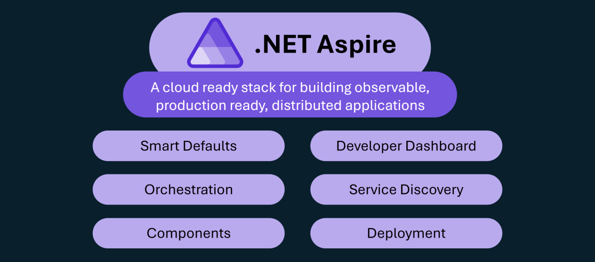

# What is .NET Aspire ?

.NET Aspire is designed to enhance the development of .NET cloud-native apps. It offers a consistent and opinionated set of tools and patterns to streamline the building and running of distributed applications.

.NET Aspire aims to assist with the following:

## Smart Defaults

.NET Aspire helps with the following:

- Observability: Monitor and analyze telemetry to understand the health and performance of an application and its components. It uses [OpenTelemetry](<https://opentelemetry.io/>), a cross-platform, open standard for collecting and emitting telemetry data.
- Resiliency: Ensure the ability of an app to recover from transient failures and continue functioning.
- Health Checks: Probe an application to determine if its components are live and healthy.  They are useful for catching anomalies and problems early, helping to ensure application stability.

A .NET Aspire solution includes a special project called 'ServiceDefaults'. This project contains code that implements the required functionality and can be shared across various components of the application.

## Developer Dashboard

.NET Aspire provides an open-source OpenTelemetry dashboard for deep insights into applications on your local development machine. It enables close tracking of various aspects, including logs, traces, and environment configurations, in real-time. Purpose-built to enhance the local development experience, it offers an insightful overview of your app's state and structure.

The dashboard is part of the .NET Aspire runtime and is also available as a Docker image: [https://aspiredashboard.com/](<https://aspiredashboard.com/>).

## Orchestration

Microservices, with their loosely coupled nature, increase the flexibility of your deployed app but can complicate configuration.

.NET Aspire provides orchestration functionality to:

- Define .NET projects, containers, executables, and cloud resources that make up the application.
- Enable service discovery by injecting endpoints and connection strings into the microservices.

A .NET Aspire solution includes a special project called 'App Host'. This project is responsible for starting all the components that make up the application and injecting any necessary configurations and dependencies into those components.

## Service Discovery

In a microservices architecture, loosely coupled services need to find each other in order to communicate. Typically, this is managed through configuration files or environment variables, but maintaining these can be challenging. It becomes even trickier in production systems where factors like auto-scaling, service upgrades, and failures can cause component instances to be dynamic and move around. Service discovery is a mechanism that enables components to find each other by tracking their instances and locations.

## Components

Microservices commonly require backing services to underpin their functionality. Examples include:

- Data storage: To persist data in structured or semi-structured stores.
- Caching: To maximize performance by storing data in a cache, allowing subsequent similar requests to be satisfied more quickly.
- Messaging: To ensure reliable communication under high network traffic or challenging conditions by persisting and distributing messages via data queues.

.NET Aspire components simplify the utilization of these backend services. Each component is a NuGet package designed for orchestration and service discovery, ensuring smooth integration of the service functionality within the application

Out-of-the-box, .NET Aspire components include:

- Data storage: PostgreSQL, SQL Database, Azure Cosmos DB, and MongoDB.
- Caching: Redis.
- Messaging: RabbitMQ and Azure Service Bus.

## Deployment

.NET Aspire focuses on development rather than production environments.

It generates a manifest that empowers tool builders to create deployment tooling for diverse platforms.

Currently, .NET Aspire supports deployment to Azure Container Apps via the Azure Developer CLI.

Support for additional deployment environments will expand progressively over time.

The telemetry should be switched to target something more robust than the developer dashboard,  such as Application Insights in Azure Monitor.

## Tooling

.NET Aspire enhances developer tooling in Visual Studio 2022 / Visual Studio Code.

New project templates allow quick creation of .NET Aspire solutions through a wizard. Additional menu items enable easy integration of .NET Aspire components, project registration for .NET Aspire orchestrator support, and other essential tasks
